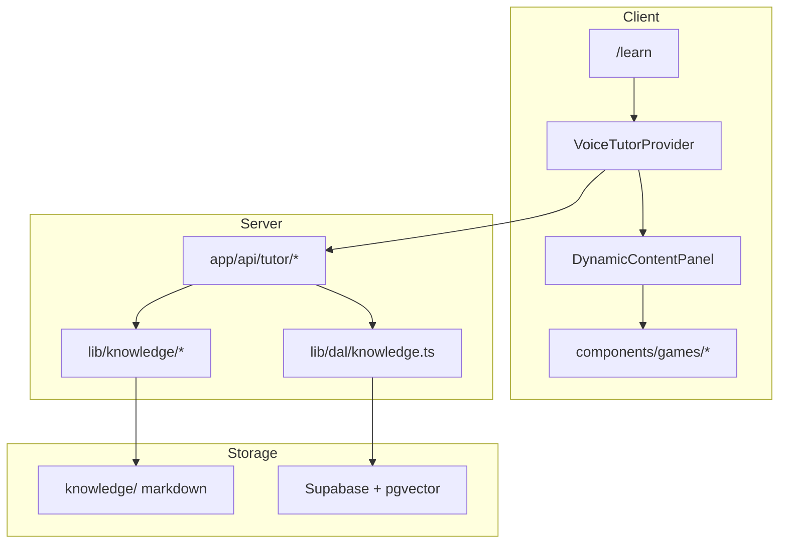

# AGENTS.md — English Pathway

Context guide for AI agents and developers. Complements [README.md](README.md): the README covers operational setup; this document explains **what the application is, how it is organized, and how to implement changes** without exploring the entire repository.

---

## 1. Product summary

**English Pathway** is an AI-guided English learning platform with an interactive activity panel and a simple **account** experience.

| Aspect | Detail |
|--------|--------|
| Audiences | Public visitors and registered users |
| Auth | Login / register → `/settings` (profile only) |
| Learning | `/learn` — AI voice/text tutor + dynamic activity panel |
| Knowledge base | 14 modules / 77 chapters in [`knowledge/`](knowledge/) (markdown + JSON) |
| RAG | `knowledge_embeddings` in Supabase — ingest via `pnpm kb:embed` |
| UI language | English only (no i18n) |
| Roles | None — no admin, teacher, or student roles |

---

## 2. Tech stack

| Layer | Technology |
|-------|------------|
| Framework | Next.js 16 (App Router, `output: 'standalone'`) |
| UI | React 19, Tailwind CSS v4, Radix UI, Framer Motion |
| Voice tutor | ElevenLabs (`@elevenlabs/react`) |
| Client state | Zustand + `persist` (`useLearnSessionStore`, `useThemeStore`) |
| Backend | Supabase (Auth, PostgreSQL, RLS, pgvector RAG) |
| Embeddings | OpenAI `text-embedding-3-small` |
| Validation | Zod 4 |
| Tests | Vitest |
| Package manager | pnpm 10, Node.js 22+ |

### Key scripts

```bash
pnpm dev          # Dev server
pnpm build        # Production build
pnpm test         # Vitest
pnpm lint         # ESLint
pnpm db:start     # Start local Supabase (Docker)
pnpm db:seed      # Legal documents only
pnpm kb:embed     # Embed knowledge/ into RAG
```

For full setup, environment variables, and troubleshooting, see [README.md](README.md) and [`.env.example`](.env.example).

---

## 3. Architecture

### Layer diagram



### Route groups

| Group | Routes | Auth |
|-------|--------|------|
| `(public)` | `/`, `/how-it-works`, `/faq` | None |
| `(learn)` | `/learn` | None |
| `(auth)` | `/login`, `/register`, `/forgot-password`, `/reset-password` | Guest only |
| `(account)` | `/settings` | Required |
| `(legal)` | `/legal/*` | None |

Post-login redirect: `/settings`. `/games/*` redirects to `/learn`. Legacy `/dashboard`, `/admin`, `/teacher` redirect to `/`.

### Content resolution

```typescript
// lib/content/resolve.ts — file-first from knowledge/
export async function resolveChapter(chapterId: string) {
  return getKnowledgeChapter(chapterId)
}
```

Curriculum lives in [`knowledge/`](knowledge/). No in-app CMS.

---

## 4. Directory map

```
english-pathway/
├── app/
│   ├── (public)/          # Landing, FAQ, how-it-works
│   ├── (learn)/           # AI tutor session
│   ├── (auth)/            # Login, register, password reset
│   ├── (account)/         # Settings (authenticated)
│   ├── (legal)/           # Terms, privacy, cookies
│   ├── api/tutor/         # Context, activity, session APIs
│   └── auth/              # OAuth and email callbacks
├── components/
│   ├── learn/             # ActivityRenderer, DynamicContentPanel
│   ├── voice/             # VoiceTutorProvider, client tools
│   ├── games/             # Interactive activity components
│   └── lesson/            # MarkdownWithTts
├── knowledge/             # Markdown knowledge base (SSOT)
├── lib/
│   ├── knowledge/         # Load, chunk, catalog
│   ├── learn/             # resolve-activity, client-tools
│   ├── rag/               # OpenAI embeddings
│   └── dal/               # Supabase data access
├── stores/                # useLearnSessionStore, useThemeStore
└── scripts/
    ├── embed-knowledge.ts # RAG ingest
    └── seed.ts            # Legal docs only
```

---

## 5. Auth flow

1. Forms in `app/(auth)/` → server actions in [`lib/auth/actions.ts`](lib/auth/actions.ts)
2. OAuth/email → callbacks in `app/auth/callback/` and `app/auth/confirm/`
3. Middleware in [`lib/supabase/middleware.ts`](lib/supabase/middleware.ts):
   - `/settings` requires auth
   - Auth routes redirect logged-in users to `/settings`

---

## 6. Tutor and activities

- Voice provider: [`components/voice/VoiceTutorProvider.tsx`](components/voice/VoiceTutorProvider.tsx)
- Client tools: [`lib/learn/client-tools.ts`](lib/learn/client-tools.ts) — `showGrammar`, `showActivity`, `showQuestion`, `clearPanel`, `fetchCurriculumContext`
- Activity components: [`components/games/`](components/games/) — Quiz, Flashcard, WordMatch, etc.
- Panel state: [`stores/useLearnSessionStore.ts`](stores/useLearnSessionStore.ts)
- Scoring: [`lib/games/scoring.ts`](lib/games/scoring.ts)

---

## 7. Database

### Core tables

- `profiles` — user profile
- `knowledge_embeddings` — RAG chunks (pgvector)
- `legal_documents`, `user_consents` — legal pages
- `analytics_events` — product analytics

Legacy curriculum tables (`modules`, `chapters`, `activities`) may exist from older migrations but are **not seeded** — use `knowledge/` instead.

After schema changes: `pnpm db:types`

---

## 8. Implementation guides

### Add or edit curriculum

1. Edit `knowledge/modules/<module>/chapters/<chapter>/chapter.md`
2. Edit `activities.json` in the same folder
3. Run `pnpm kb:embed`

Pedagogical content may remain in Spanish; UI is English.

### Add an API route

1. Create `app/api/<name>/route.ts`
2. Validate with Zod
3. Delegate to DAL in `lib/dal/`

### UI copy

All user-facing strings are **hardcoded English** in components. There is no i18n layer.

---

## 9. PR checklist

- [ ] `pnpm lint` passes
- [ ] `pnpm build` succeeds
- [ ] New UI strings are in English
- [ ] If `knowledge/` changed: run `pnpm kb:embed`
- [ ] If migrations changed: run `pnpm db:types`
- [ ] No secrets or `.env.local` in commits
