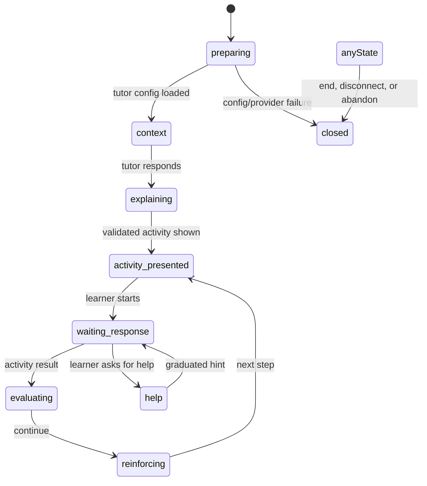

# Tutor session orchestration

`VoiceTutorProvider` is now a coordinator. The connection lifecycle lives in `useTutorSession`, microphone permissions and stream cleanup live in `useMicrophoneAccess`, activity side effects live in `useTutorActivityActions`, and ElevenLabs tool dispatch remains in `TutorClientTools`.

## Failure paths

| Failure | User-facing recovery |
| --- | --- |
| Microphone unavailable or permission denied | Keep the session usable in text mode; release any partial stream. |
| Tutor session endpoint fails | Show a retryable error and keep the mode selector available. |
| Voice is not configured | Explain that text mode remains available. |
| Provider disconnects | Record the compact closed session state and return to the preflight state. |
| Tool payload is invalid | Reject the tool call without mutating the activity panel. |
| SRS/progress/memory side effect fails | Keep the learning activity usable; these enhancements retry independently. |

The state transition reducer in `lib/tutor/state.ts`, the microphone cleanup helper, and the session launch policy are unit-tested. This keeps connection and permission failures isolated from the visual tutor layout.
