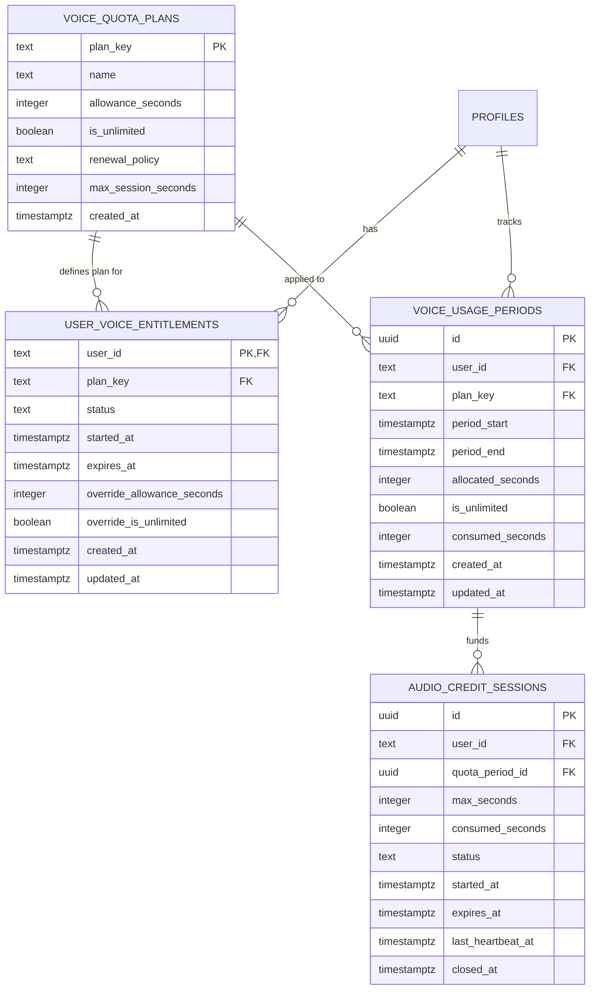

# Voice Quotas and Entitlements Architecture

This document describes the plan-aware and period-aware voice quota architecture in English Pathway. It covers data models, SQL RPC contracts, deterministic period renewal/rollover, session concurrency and settlement, unlimited plan handling, and future billing webhook integration.

---

## 1. Core Concepts & Data Model

The voice quota system separates plan definitions, learner entitlements, periodic usage tracking, and realtime audio session leases:



### Table Definitions

1. **`voice_quota_plans`**: Master catalog of voice quota tiers.
   - `plan_key`: Unique string identifier (`free`, `monthly_standard`, `monthly_unlimited`).
   - `name`: Display name.
   - `allowance_seconds`: Seconds granted per period (`NULL` when `is_unlimited = true`).
   - `is_unlimited`: Boolean flag indicating if allowance checks are bypassed.
   - `renewal_policy`: `lifetime` (no rollover), `monthly`, `yearly`, or `none`.
   - `max_session_seconds`: Technical per-session ceiling (e.g. 1,200s or 1,800s) to prevent runaway WebRTC connections.

2. **`user_voice_entitlements`**: Learner-assigned plan mapping.
   - `user_id`: Clerk user ID (`TEXT`), referencing `profiles(id)`.
   - `plan_key`: Plan assigned to the learner.
   - `status`: `active`, `paused`, `canceled`, or `expired`.
   - `started_at` / `expires_at`: Entitlement lifecycle boundaries.
   - `override_allowance_seconds` / `override_is_unlimited`: Safe individual overrides for promotions, custom grants, or trial extensions.

3. **`voice_usage_periods`**: Usage ledger per period.
   - `id`: UUID primary key.
   - `user_id`: Learner ID.
   - `plan_key`: Plan active during this period.
   - `period_start` / `period_end`: Billing/usage window (`period_end = NULL` for lifetime free).
   - `allocated_seconds`: Snapshot of granted seconds for the window.
   - `is_unlimited`: Snapshot of unlimited status.
   - `consumed_seconds`: Total seconds charged in this period.

4. **`audio_credit_sessions`**: Ephemeral realtime voice session leases.
   - `quota_period_id`: Foreign key to `voice_usage_periods(id)`.
   - `max_seconds`: Session-specific upper bound (`LEAST(plan_max_session_seconds, remaining_seconds)` or `plan_max_session_seconds` for unlimited).
   - `status`: `active`, `closed`, or `expired`.
   - `expires_at`: Sliding lease deadline (extended by heartbeats up to `started_at + max_seconds`).
   - `last_heartbeat_at`: Timestamp of latest client heartbeat.

---

## 2. Seeded Plans

| Plan Key | Name | Allowance | Renewal | Max Realtime Session | Description |
| :--- | :--- | :--- | :--- | :--- | :--- |
| `free` | Free Trial | 1,200s (20 min) | `lifetime` | 1,200s (20 min) | Default allowance for all registered learners |
| `monthly_standard` | Monthly Standard | 3,600s (60 min) | `monthly` | 1,200s (20 min) | 60 minutes per monthly billing cycle |
| `monthly_unlimited` | Monthly Unlimited | Unlimited | `monthly` | 1,800s (30 min) | Unlimited voice with 30-min per-session safety cap |

---

## 3. Deterministic Lazy Renewal Semantics

Renewal does not require background cron workers. Instead, periods roll over deterministically on demand inside `resolve_or_create_voice_period`:

1. **Lifetime Plans (`free`)**:
   - `period_start` is set to the user's initial start date.
   - `period_end` is `NULL`.
   - The period never expires and accumulates usage up to the allocated ceiling.

2. **Periodic Plans (`monthly`)**:
   - When `NOW() >= period_end`, the system advances `period_start` and `period_end` in 1-month intervals until `period_end > NOW()`.
   - If a learner is inactive for multiple months, the algorithm deterministically skips unused intermediate periods and instantiates the active current monthly window.
   - A new `voice_usage_periods` record is inserted with `consumed_seconds = 0` and the current entitlement's snapshot allowance.

---

## 4. RPC Contracts

### `get_usage_credits(p_user_id TEXT)`
Returns the unified quota contract:
```json
{
  "audioSecondsRemaining": 1150,
  "assistantMessagesRemaining": 50,
  "hasActiveSession": false,
  "activeSessionElapsed": 0,
  "voiceQuota": {
    "planKey": "free",
    "planName": "Free Trial",
    "isUnlimited": false,
    "allowanceSeconds": 1200,
    "consumedSeconds": 50,
    "remainingSeconds": 1150,
    "periodStart": "2026-08-01T00:00:00Z",
    "periodEnd": null,
    "maxSessionSeconds": 1200
  }
}
```

### `start_audio_credit_session(p_user_id TEXT)`
- Atomically recovers any expired leases (`expires_at <= NOW()`) by settling observed elapsed time + grace.
- Acquires `FOR UPDATE` lock on active period.
- Checks if another unexpired session is active; returns `{ "allowed": false, "reason": "active_session" }` on collision.
- For finite plans: computes `remaining_seconds = allocated_seconds - consumed_seconds`. Rejects with `{ "allowed": false, "reason": "credits_exhausted" }` if `<= 0`.
- Sets session `max_seconds = is_unlimited ? max_session_seconds : LEAST(max_session_seconds, remaining_seconds)`.
- Grants sliding initial lease `LEAST(NOW() + 90s, NOW() + max_seconds)`.
- Returns `{ "allowed": true, "sessionId": "...", "maxSeconds": 1200, "isUnlimited": false }`.

### `heartbeat_audio_credit_session(p_session_id UUID, p_user_id TEXT)`
- Extends lease: `expires_at = LEAST(NOW() + 90s, started_at + max_seconds)`.
- Updates `last_heartbeat_at = NOW()`.
- Returns `{ "sessionId": "...", "elapsed": 30, "remaining": 1170 }`.

### `finish_audio_credit_session(p_session_id UUID, p_seconds INTEGER, p_user_id TEXT)`
- Clamps reported seconds: `charged_seconds = LEAST(session_row.max_seconds, LEAST(p_seconds, server_elapsed + 5))`.
- Sets session `status = 'closed'`, `consumed_seconds = charged_seconds`, `closed_at = NOW()`.
- Atomically charges `voice_usage_periods.consumed_seconds += charged_seconds`.
- Returns updated quota contract via `get_usage_credits`.

---

## 5. Future Billing Integration Point (Stripe / Paddle)

When a billing provider is introduced, webhooks should interact exclusively with `user_voice_entitlements`:

```typescript
// Example: Future Stripe webhook handler
export async function handleSubscriptionEvent(event: StripeWebhookEvent) {
  const { customerId, clerkUserId, planKey, status, currentPeriodStart, currentPeriodEnd } = extractSubscription(event)

  await supabase.from('user_voice_entitlements').upsert({
    user_id: clerkUserId,
    plan_key: planKey, // e.g. 'monthly_standard' or 'monthly_unlimited'
    status: status === 'active' ? 'active' : 'canceled',
    started_at: currentPeriodStart.toISOString(),
    expires_at: currentPeriodEnd.toISOString(),
    updated_at: new Date().toISOString(),
  })
}
```

The database functions automatically detect plan changes on the learner's next interaction, provisioning the corresponding period without requiring synchronous coordination.
