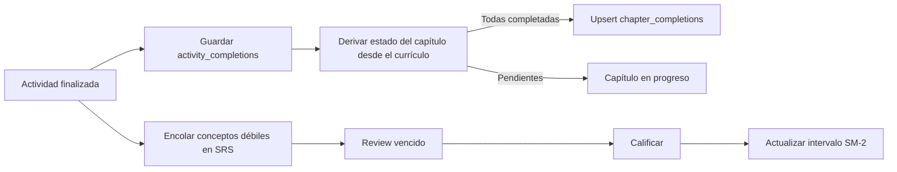

# Plan integral: capítulos y repasos

## Objetivo

Mantener un único estado verificable para el avance del currículo y para los repasos espaciados, de modo que el progreso mostrado en currículo, dashboard, tutor y navegación coincida con los datos persistidos del usuario.

## Contrato funcional

1. Una actividad completada se registra una sola vez por usuario y actividad, conservando la mejor puntuación y el número de intentos.
2. Cuando todas las actividades de un capítulo están completadas, el servidor completa el capítulo automáticamente. La operación es idempotente.
3. Los conteos de capítulos se obtienen de `chapter_completions` sin límites de presentación; las listas recientes pueden limitarse por separado.
4. El progreso anónimo se valida y reconcilia al iniciar sesión, incluida la finalización automática de capítulos que ya tengan todas sus actividades.
5. Los conceptos con errores se encolan como elementos SRS estables por `content_ref`; completar una revisión vuelve a calcular su fecha con SM-2.
6. La pantalla de review consume todos los elementos vencidos por lotes y nunca muestra “All caught up” mientras aún existan elementos vencidos.
7. Los indicadores SRS se actualizan después de encolar o calificar un review, sin esperar el sondeo periódico.

## Flujo canónico

## Implementación de esta entrega

- Centralizar el cierre automático en los casos de uso del servidor, tanto para actividad autenticada como para la sincronización de progreso anónimo.
- Ejecutar la sincronización de progreso anónimo al cargar cualquier sesión autenticada, no solo la pantalla del tutor.
- Corregir el conteo total del dashboard y entregarle el total real de capítulos para el estado de currículo completo.
- Reiniciar índice y recargar el siguiente lote de reviews al terminar uno; notificar a los badges cuando la cola cambia.
- Añadir pruebas de regresión para la elegibilidad de capítulo y la selección de capítulos completables durante una sincronización.

## Validación

- Ejecutar pruebas unitarias de currículo, progreso, SRS y continuación.
- Ejecutar lint y build.
- Verificar que la validación de actividades siga pasando, pues los `content_ref` de SRS dependen de esos datos.
