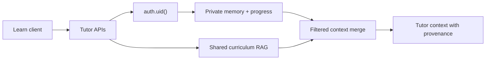

# Personalization and RAG data architecture

The curriculum in `knowledge/` and `knowledge_embeddings` is shared canonical content. It is never copied into a learner row. Private personalization consists of the authenticated learner's profile, progress, short session summaries, and optional bounded memory notes.

## Contracts and isolation

- The server obtains the user identity from the Supabase session. No endpoint accepts `user_id` as authority.
- `user_progress`, activity/chapter completion, SRS, engagement, `tutor_session_summaries`, and `learner_memory` are owner-scoped by RLS (`auth.uid() = user_id`).
- `knowledge_embeddings` remains shared canonical content. Its service-layer retrieval is filtered by curriculum metadata and never by a client-supplied user ID.
- Private memory is keyword-filtered in the server context builder and merged before shared matches with a `personal` provenance marker. Anonymous requests receive no private records.
- Correlation IDs make session summary writes idempotent. Memory keys make repeated activity/help writes idempotent per user.

## Retention and deletion

Session summaries expire after 365 days. They contain a short bounded summary, state, activity ID, and strategy version only; audio, credentials, secrets, and full transcripts are rejected by the API contract. Learner memory is capped at 2,000 characters per key and is explicitly deletable.

`GET /api/tutor/memory` exports the private tutor data visible to the authenticated user. `DELETE /api/tutor/memory?memoryKey=...` removes one note; without a key it removes all private tutor summaries and notes for that user. Shared curriculum data is not deleted by learner actions.

The strategy versions (`tutor-memory-v1` and `learner-memory-v1`) allow future recalculation or rollback without silently changing a confirmed level.

## Security review checklist

- [x] Private tables have RLS and owner-only read/write/delete policies.
- [x] Analytics reads are owner-only; anonymous events may be inserted but cannot be read.
- [x] Shared RAG is not duplicated per learner, and anonymous direct RPC execution is revoked.
- [x] User-facing retrieval returns provenance and bounded content, not raw database rows.
- [x] Negative isolation coverage is maintained by the migration policies and server endpoints always derive identity from `auth.getUser()`.
